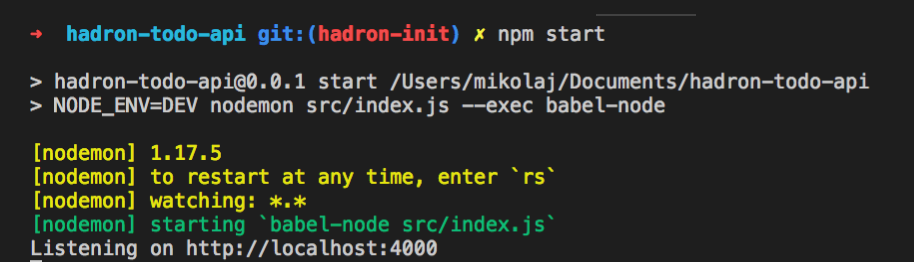

## Hello World with Hadron

First of all, let's create a `hello world` route with the **Hadron** framework, we are going to build a simple route on `/` which will return `200` status and the `message: Hello World` in the body response.

To do it we need to init the hadron-core and hadron-express modules.

##### Installation:
* hadron-core:

```bash
npm install --save @brainhubeu/hadron-core
```

* hadron-express:

```bash
npm install --save @brainhubeu/hadron-express express
```

Now we can create the file `src/index.js` where we are going to init **Hadron**:

```javascript
// src/index.js
import express from 'express';
import hadron from '@brainhubeu/hadron-core';
import hadronExpress from '@brainhubeu/hadron-express';

const port = process.env.PORT || 4000;
const expressApp = express();

const config = {
    routes: {
        helloWorldRoute: {
            path: '/',
            methods: ['GET'],
            callback: () => ({ status: 200, body: { message: 'Hello World' } }),
        },
    },
};

const hadronInit = async () => {
    const container = await hadron(expressApp, [hadronExpress], config);

    expressApp.listen(port, () => {
        console.log(`Listening on http://localhost:${port}`);
    });
};

hadronInit();
```

Now when we run our server:

```bash
npm start
```
Where the start command is:

```json
"start": "NODE_ENV=DEV nodemon src/index.js --exec babel-node",
```
---

#### **Warning**
To have a working command as above, we need to install some dependencies:

```bash
npm install --save-dev nodemon babel-cli babel-preset-env babel-preset-stage-3
```

And also install `babel-node` globally:
```bash
npm install -g babel-node
```

Next you need to configure babelrc, create a file in main directory called `.babelrc`:
```json
{
    "presets": [
        "env",
        "stage-3"
    ]
}
```

Now you should be ready.

---

We should see:



And when we enter `http://localhost:4000/`, we should receive the hello world message from our server:
```javascript
{
    message: "Hello World"
}
```