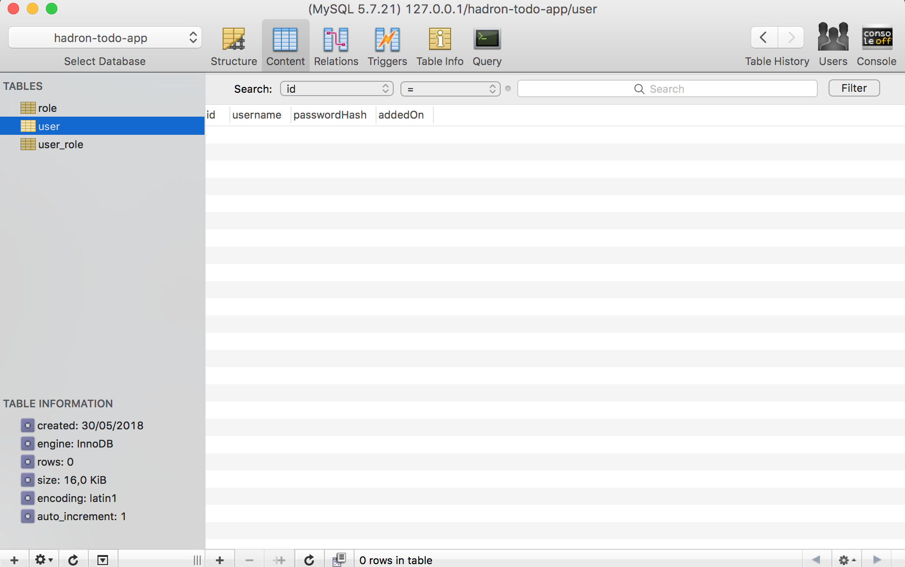

### Connecting hadron to a MySQL database with TypeORM

First let's create `User` and `Role` schemas for our database.

We are going to create a `src/schemas` directory and create `User.js` and `Role.js` there.

**User schema**:
```javascript
// src/schemas/User.js
const userSchema = {
    name: 'User',
    columns: {
        id: {
            primary: true,
            type: "int",
            generated: true,
        },
        username: {
            type: "varchar",
            unique: true,
        },
        passwordHash: {
            type: "varchar",
        },
        addedOn: {
            type: 'timestamp',
        },
    },
    relations: {
        roles: {
            target: "Role",
            type: "many-to-many",
            joinTable: {
                name: 'user_role'
            }
        },
    },
};

export default userSchema;
```

**Role schema**:
```javascript
// src/schemas/Role.js
const roleSchema = {
    name: 'Role',
    columns: {
        id: {
            primary: true,
            type: 'int',
            generated: true,
        },
        name: {
            type: 'varchar',
            unique: true,
        },
        addedOn: {
            type: 'timestamp',
        },
    },
};

export default roleSchema;
```

Now we can try to put these tables in our database, but before that, we need to install MySQL and create a database.

We recommend using Docker to install MySQL:

```bash
docker run --name some-mysql -e MYSQL_ROOT_PASSWORD=my-secret-pw -d -p 3306:3306 mysql
```

Now we can connect to our database with a database managment application, like PhpMyAdmin or Sequel, with this config:

```bash
host: 127.0.0.1
username: root
password: my-secret-pw
```

In there we need to create a new database, for example let's create one named `hadron-todo-app`.

When we have met the requirements, we can init **hadron-typeorm**. First, we need to install the hadron-typeorm module and mysql dependency:

```bash 
npm install --save @brainhubeu/hadron-typeorm mysql
```
Secondly, we need to prepare a configuration file (in src/config/db.js):

```javascript
// src/config/db.js
import userSchema from '../schemas/User';
import roleSchema from '../schemas/Role';

const connection = {
  name: 'mysql-connection',
  type: 'mysql',
  host: 'localhost',
  port: 3306,
  username: 'root',
  password: 'my-secret-pw',
  database: 'todo-app',
  entitySchemas: [roleSchema, userSchema],
  synchronize: true,
};

export default {
    connection,
    entities: [roleSchema, userSchema]
};
```

Where we have added our ready schemas.

Finally, we need to pass our config to the hadron configuration, so we need to import the database configuration from `src/config/db.js` back in our `src/index.js`.

```javascript
import db from './config/db.js';
```

Add the database configuration to the Hadron configuration:

```javascript
const config = {
    ...db,
    routes: {
        helloWorldRoute: {
            path: '/',
            methods: ['GET'],
            callback: () => ({ status: 200, body: { message: 'Hello World' } }),
        },
    },
};
```

And add hadron-typeorm module to hadron:

```javascript
import * as hadronExpress from '@brainhubeu/hadron-express';
import * as hadronTypeOrm from '@brainhub/hadron-typeorm';

// ...

const hadronInit = async () => {
    const container = await hadron(expressApp, 
        [hadronExpress, hadronTypeOrm],
        config);
```

Now when we run the server, we should see new empty tables in the database which have values from our schemas:

