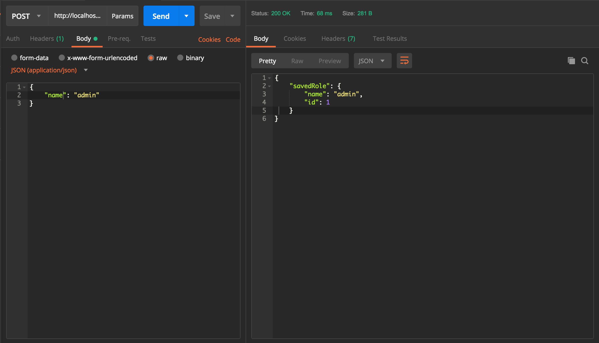

### Services with Hadron.js
Let's start with a simple CRUD for the `Role` model.
**hadron-core** provides a container, which can be used anywhere in the app, **hadron-typeorm** by default registers repositories for included schemas and with **hadron-express** we can use the container in the callback, like this:
```javascript
const callback = (request, { containerItemByKey }) => {
    return {
        status: 200,
        body: {},
    };
};
```
Hadron-typeorm registers schemas with the key `schema_name+"repository"`, for example the repository for our role schema will be named `roleRepository`, so in the callback, we can use the role repository, like this:

```javascript
const findOneByName = async (request, { roleRepository }) => {
    const role = await roleRepository.findOne({ where: { name: req.params.name } });

    return {
        status: 200,
        body: {
            role,
        },
    };
};
```

Let's create a `src/services` folder and put `roleService.js` inside, where we will write our first role method:

```javascript
export const save = async (req, { roleRepository }) => {
    try {
    const role = await roleRepository.findOne({ where: { name: req.body.name } });

    if (role) {
        return userError(`Role: "${req.body.name}" already exists.`);
    }

    const savedRole = await roleRepository.save(req.body);

    return {
        status: 200,
        body: {
            savedRole,
        },
    };

    } catch (error) {
        return {
            status: 500,
            body: {
                error: {
                    message: error.message,
                },
            },
        };
    }
};
```
Also we can create helper methods for responses:

```javascript
export const notFound = message => {
    return {
        status: 404,
        body: {
            error: {
                message,
            },
        },
    };
};

export const userError = message => {
    return {
        status: 400,
        body: {
            error: {
                message,
            },
        },
    };
};
```

Now to see if it works, we need to create a route for the save role, let's create a `src/routes` directory and place `role.js` inside:

```javascript
import * as roleService from '../services/roleService';

const roleRoutes = () => {
    return {
        saveRole: {
            path: '/api/role',
            methods: ['POST'],
            callback: roleService.save,
        },
    };
};

module.exports = roleRoutes;
```

Of course we need add this route to hadron, we will use **hadron-json-provider** for that:

```bash
npm install --save @brainhubeu/hadron-json-provider
```

Now `src/index.js` look like:
```javascript
import express from 'express';
import hadron from '@brainhubeu/hadron-core';
import jsonProvider from '@brainhubeu/hadron-json-provider';
import * as hadronExpress from '@brainhubeu/hadron-express';
import * as hadronTypeOrm from '@brainhubeu/hadron-typeorm';
import db from './config/db';
import cors from 'cors';
import bodyParser from 'body-parser';

const port = process.env.PORT || 4000;
const expressApp = express();

expressApp.use(cors());
expressApp.use(bodyParser.json());

const hadronInit = async () => {
    const routes = await jsonProvider([`${__dirname}/routes/*`], ['js']);

    const config = {
        ...db,
        routes,
    };

    const container = await hadron(expressApp, 
        [hadronExpress, hadronTypeOrm],
        config);

    expressApp.listen(port, () => {
        console.log(`Listening on http://localhost:${port}`);
    });
};

hadronInit();
```

---

Don't forget to install cors and body-parser dependencies:
```bash
npm install --save cors body-parser
```

---

Now we can try using the `/api/role` route with `POST` method and proper request body:



As you can see it works, but we don't have any information when data is invalid, let's change it with the **hadron-validation** module:

```bash
npm install @brainhubeu/hadron-validation --save
```

hadron-validation throws an error with a proper message if the data is invalid otherwise it passes the object.

We need to create a validation schema for inserting a role:

```javascript
// src/validation/schemas/insertRole.json
{
    "type": "object",
    "properties": {
        "name": {
            "type": "string"
        }
    },
    "required": ["name"],
    "additionalProperties": false
}
```

Now we need to create a validate method:

```javascript
// src/validation/validate.js
import insertRole from './schemas/insertRole.json';
import validatorFactory from '@brainhubeu/hadron-validation';

export default validatorFactory({
    insertRole,
});
```

And now we can use our validate method in the service.

First, we need to import it:

```javascript 
// src/services/roleService.js
import validate from '../validation/validate';
```
Usage:

```javascript
// src/services/roleService.js
export const save = async (req, { roleRepository }) => {
    try {
    const data = await validate('insertRole', req.body);
    const role = await roleRepository.findOne({ where: { name: data.name } });

    if (role) {
        return userError(`Role: "${data.name}" already exists.`);
    }

    const savedRole = await roleRepository.save(data);

    return {
        status: 200,
        body: {
            savedRole,
        },
    };

    } catch (error) {
        return userError(error.message);
    }
};
```

Now we can finish the service and routes for our `Role`:

**Update**:
* method:

```javascript
export const update = async (req, { roleRepository }) => {
    try {
        const data = await validate('insertRole', req.body);
        
        const role = await roleRepository.findOne({ where: { id: req.params.id } });

        if (!role) {
            return notFound(`Role with id: "${req.params.id}" does not exists.`);
        }

        role.name = data.name;

        const updatedRole = await roleRepository.save(role);

        return {
            status: 201,
            body: {
                updatedRole,
            },
        };

    } catch (error) {
        return userError(error.message);
    }
};
```

* route:

```javascript
updateRole: {
    path: '/api/role/:id',
    methods: ['PUT'],
    callback: roleService.update,
},
```

**Find One By Id**:
* method:

```javascript
export const findOneById = async (req, { roleRepository }) => {
    try {
        const role = await roleRepository.findOne({ where: { id: req.params.id } });

        if (!role) {
            return notFound(`Role with id: "${req.params.id}" does not exists.`);
        }

        return {
            status: 200,
            body: {
                role,
            },
        };
    } catch (error) {
        return serverError(error.message);
    }
};
```

* route:

```javascript
findRoleById: {
    path: '/api/role/:id',
    methods: ['GET'],
    callback: roleService.findOneById,
},
```

**Find One By Name**
* method:

```javascript
export const findOneByName = async (req, { roleRepository }) => {
    try {
        const role = await roleRepository.findOne({ where: { name: req.params.name } });

        if (!role) {
            return notFound(`Role with name: "${req.params.name}" does not exists.`);
        }

        return {
            status: 200,
            body: {
                role,
            },
        };
    } catch (error) {
        return serverError(error.message);
    }
};
```

* route:

```javascript
findRoleByName: {
    path: '/api/role/byName/:name',
    methods: ['GET'],
    callback: roleService.findOneByName,
},
```

**Find All**
* method:

```javascript
export const findAll = async (req, { roleRepository }) => {
    try {
        const roles = await roleRepository.find();

        return {
            status: 200,
            body: {
                roles,
            },
        };
    } catch (error) {
        return serverError(error.message);
    }
};
```

* route:

```javascript
findAllRoles: {
    path: '/api/role',
    methods: ['GET'],
    callback: roleService.findAll,
},
```

Full role service and role routes can be found here: [roleService](tutorial/sub/roleService)

Now let's create the `Task` schema:

```javascript
const taskSchema = {
    name: 'Task',
    columns: {
        id: {
            primary: true,
            type: "int",
            generated: true,
        },
        description: {
            type: "varchar",
        },
        userId: {
            type: 'int',
            required: true,
        },
        completed: {
            type: 'tinyint',
            default: false,
        },
        addedOn: {
            type: 'timestamp',
        },
    },
};

export default taskSchema;
```

**Don't forget to add Task to database config.**

Now you can implement a service and routes for `User` and `Task` models.
If you have any problems here you can check:
* [User Service and routes](tutorial/sub/userService)
* [Task Service and routes](tutorial/sub/taskService)
* [Custom responses](tutorial/sub/responses)


--- 
# WARNING
#### Hadron-Auth module is not finished yet

---