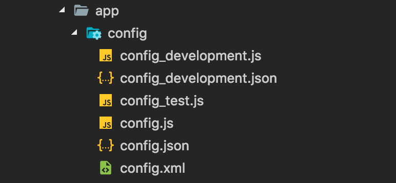

#JSON Provider

##What is JSON Provider?
JSON Provider allows you to build a JSON object from files.  

####Supported types:
* **js**
* **json**
* **xml**

##Installation
Install **hadron-json-provider** module from npm (TODO)
```bash
    $npm install --save hadron-json-provider
```

##Usage
To use JSON Provider you need to pass array of strings which contains paths to files.
Second argument is an array of strings which contains extensions of files from which you want to build an JSON object.

##Example
#### JSON Provider

To find all files in **./routing/*\*/\*** with extension **config.js**


You can use **jsonProvider** function:
```javascript
    jsonProvider(['./routing/**/*'], ['config.js'])
    .then(object => {
        
    }).catch(error => {

    });
```
#### Configuration JSON Provider

If you want to build configuration object which depends on project type, for example **development**



You can use **configJsonProvider** function:

```javascript
    configJsonProvider(['./app/config/*'], 'config', 'development', ['xml', 'js'])
    .then(object => {

    })
    .catch(error => {

    });
```

First argument is string array of file paths, second argument is a name of main configuration file, third argument is a project type and the last argument is a string array of extensions.